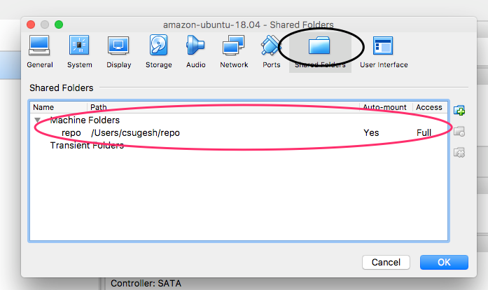

#System Boot parameters
This document explains how to start services/run script at the system boot.

## Enable rc-local with systemd

Check the status of rc-local as below.

```
    systemctl status rc-local
```

Enable the rc-local service as

```
    systemctl enable rc-local
```

Sometimes, we may get error as

```
    The unit files have no [Install] section. They are not meant to be enabled
    using systemctl.
    Possible reasons for having this kind of units are:
    1) A unit may be statically enabled by being symlinked from another unit's
    .wants/ or .requires/ directory.
    2) A unit's purpose may be to act as a helper for some other unit which has
    a requirement dependency on it.
    3) A unit may be started when needed via activation (socket, path, timer,
    D-Bus, udev, scripted systemctl call, ...).
```

systemd need a install section to enable a service, so create a service file as below.

```
    nano /etc/systemd/system/rc-local.service
```

```
[Unit]
 Description=/etc/rc.local Compatibility
 ConditionPathExists=/etc/rc.local

[Service]
 Type=forking
 ExecStart=/etc/rc.local start
 TimeoutSec=0
 StandardOutput=tty
 RemainAfterExit=yes
 SysVStartPriority=99

[Install]
 WantedBy=multi-user.target
```

From Ubuntu-16.10 , rc.local file is not present by default, so create it as below

```
printf '%s\n' '#!/bin/bash' 'exit 0' | sudo tee -a /etc/rc.local
```

change the permission as

```
    chmod +x /etc/rc.local
```

Try to enable the service again as

```
    systemctl enable rc-local
```

Once the service is enabled, Start the service as

```
    systemctl start rc-local.service
```

To check the status of service

```
    systemctl status rc-local.service
```


## Mount host directory at VM boot
In a virtualbox enviornment, host directory is mounted into VM as configured below.




To access the host directory inside the VM, it must be mounted at the boot time. we use 'rc.local' systemd service for it. Modify the rc.local file as below.

```
nano /etc/rc.local
```
```
#!/bin/bash -e
sudo mount -t vboxsf -o uid=631185614,gid=600260513 repo /home/csugesh/repo
exit 0
```
'repo' is the host directory tconfugured as virtualbox shared directory, '/home/csugesh/repo' is the mount directory inside the VM.
The uid and gid allows to mount the directory to specific user account. To get the uid and gid values,

```
$ echo $UID
631185614
```

and to find the gid

```
$ id -g
600260513
```
Verify if the mount is successful using,

```
  df -ah
```
